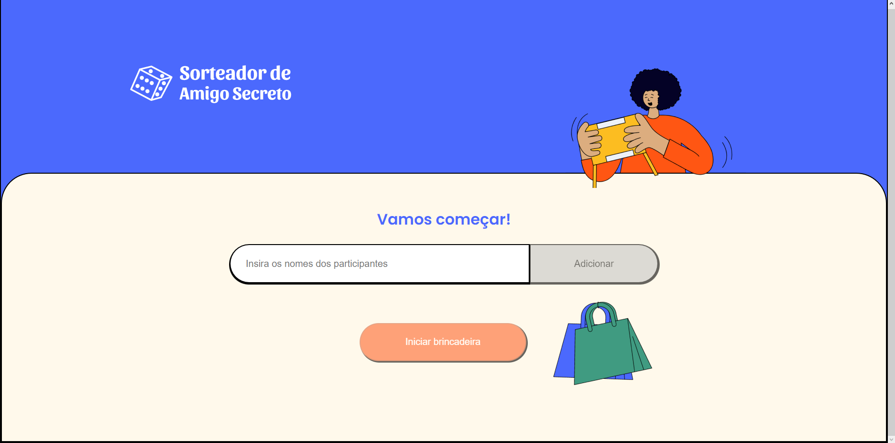

<h1 align="center">Alura Amigo Secreto</h1>

Projeto criado durante o curso de React: testando seus componentes da alura
<br />

<div align="center">
  
</div>

## 📁 Acesso
É possivel baixar o projeto nesse <a href="https://github.com/lucash-barbosa/Alura-Amigo-Secreto/archive/refs/heads/master.zip">link</a>
ou acessar o <a href="https://alura-amigo-secreto-mu.vercel.app">site</a>

## 🛠️ Abrir e rodar o projeto

```bash
npm install
npm start

# Abra o programa no navegador pelo link http://localhost:3000/
```

